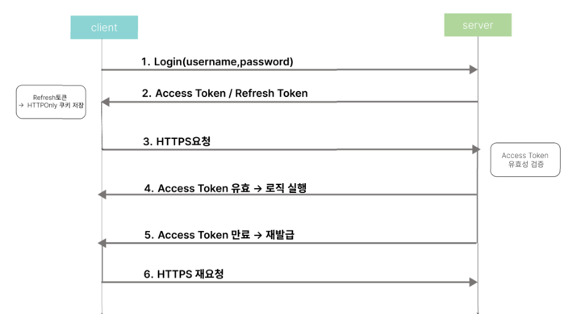
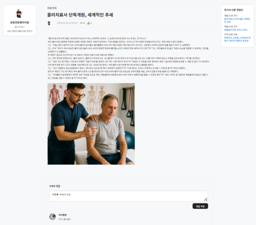
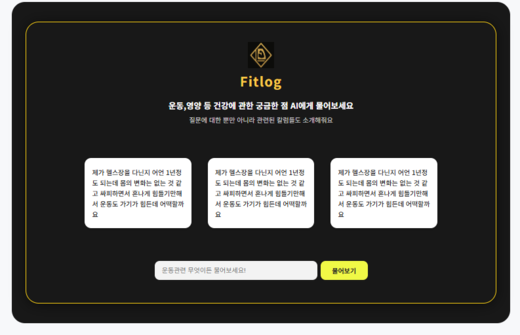

## FitLog (운동 기록, 전문가의 지식 기록 )

**Fitlog**는 헬스트레이너, 의사, 물리치료사, 영양사 등 건강 전문가들이

지식을 공유하고, 소통하며, 커리어를 성장시키는 **지식 기반 커뮤니티 플랫폼**

## 사용 스택  
- Database  
    - MySQL 
- Language  
    - Java  
    - Javascript    
- Framework 
    - Spring    
    - Vue   
- API   
    - GPT API
    - Toast API

  
## 주요 구현 기능
- TOAST API를 활용한 게시물 관리와 댓글, 추천
- GPT API를 이용한 질문, 백터내적을 활용한 게시물 내용기반 검색
- 사용자 회원 가입, 로그인, 로그아웃, 마이페이지 명함 관리

  
### 회원 가입 및 로그인
  
- 아이디,비밀번호,닉네임,직업,프로필이미지를 이용하여 회원가입

 
  
- 로그인 기능 :  
Access Token, Refresh(HTTPONLY+SECURE) 클라이언트와 상호작용  
Access Token(5분), Refresh Token(7일), Refresh Token DB저장  
5분 경과 ->  Refresh Token DB에서 일치하는지 조회 -> 일치하면 Access Token 재발급

  
### 마이페이지

- 개인정보 수정, 게시글 확인
  
### 메인 화면

- 조회수 기반 게시글 
- 최근 업로드된 게시글 
- 월별 추천수 기반 작가랭킹
   
  
### 게시판
   
- 작가페이지로 이동, 작가 인기 게시물 확인
- 게시물 확인, 댓글,좋아요,조회수, 파일 다운로드

  
### Q&A, 검색
  
- GPT API 활용한 Q&A
- 백터 내적을 활용한 게시글 내용기반 검색 
게시글 등록 시 문장을 벡터화(Embedding)하여 DB에 저장  
질문 시 백터화(Embedding) 하여 DB상의 게시물과 내적  
내적 결과 값이 큰(유사한) 게시물 3개 추천

